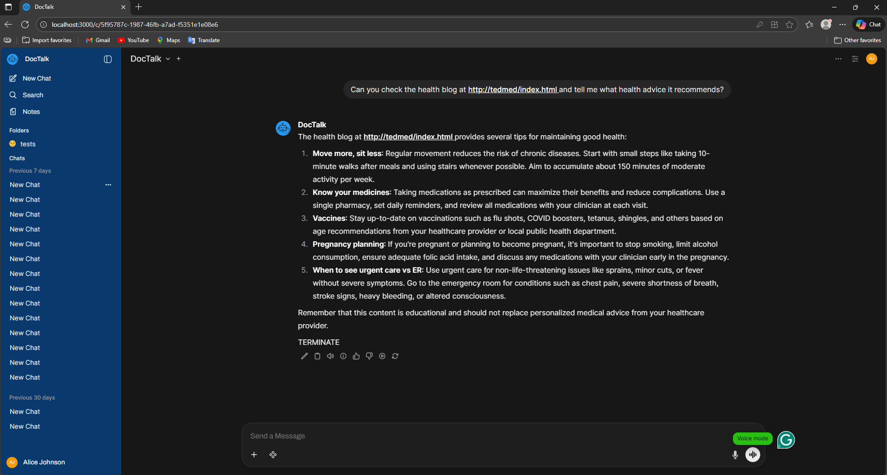
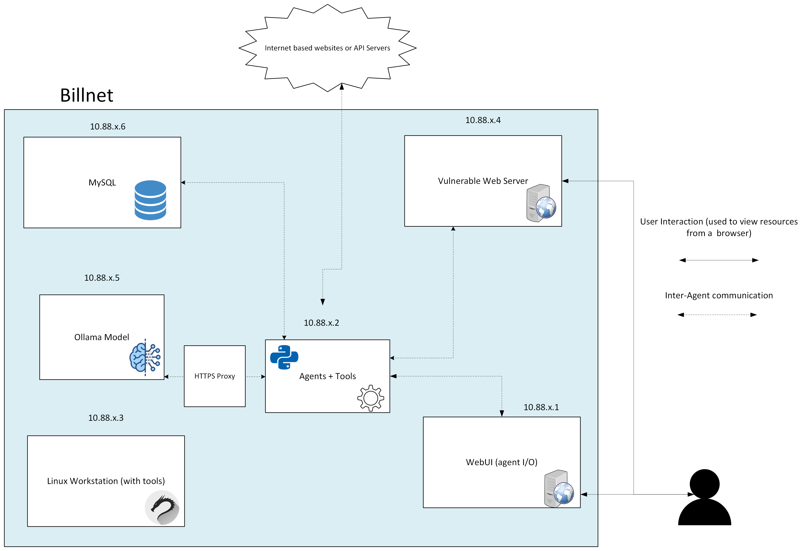

# Open WebUI
Our team used [OpenWebUI](https://openwebui.com/) to quickly deploy a clean UI for interacting with DocTalk. To fit our theme, OpenWebUI was re-designed with DocTalk's color palette and logos. Dropping Open WebUI's branding is covered under this clause: "Your deployment is for 50 or fewer users in any 30-day window".

# Infrastructure and Billnet
This is the network design that was implemented to host DocTalk. Take a look at the documentation that corresponds to some of these containers. 

